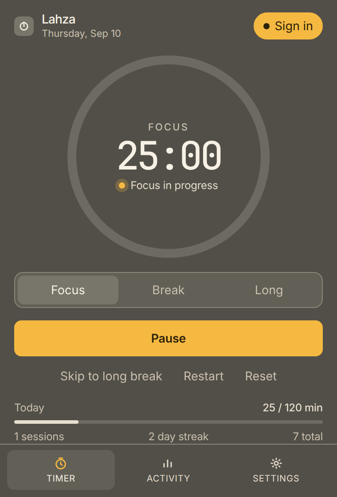
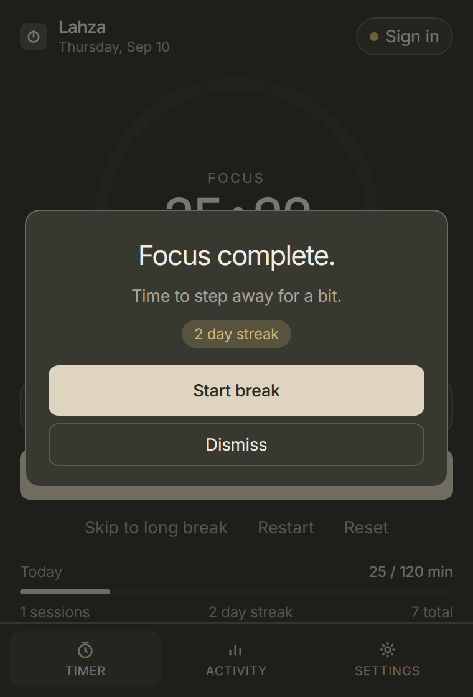
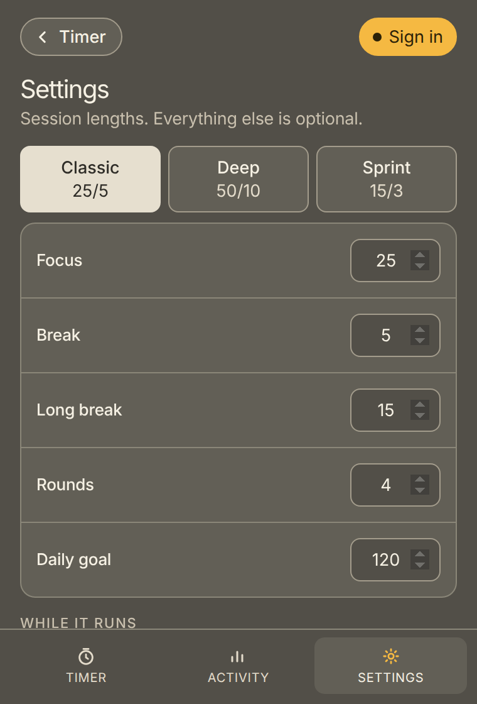

<p align="center">
  
</p>

# Lahza

**Customizable focus timer for Chrome.** Classic Pomodoro if you want 25 and 5, or set the lengths yourself. Pin it on the toolbar — while it runs, the icon shows how much time you have left.

*Lahza* (لحظة) is said **LAH-zah**.


---

## Setup

[Download `lahza.zip`](release/lahza.zip). Unzip it. Then:

1. In Chrome, go to `chrome://extensions`
2. Turn on **Developer mode**
3. **Load unpacked**
4. Select the unzipped folder (it has `manifest.json` in it)
5. Pin **Lahza**

To build from source instead: [Node.js](https://nodejs.org/) 18+ (LTS), then:

```bash
git clone https://github.com/shahjacobb/Forge-Extension.git
cd Forge-Extension
npm install
npm run build
```

Load unpacked on the **`dist`** folder that creates.

After you change the code: `npm run build`, then **Reload** on the extension card.

---

## How to navigate

The popup has three tabs at the bottom. Settings and Activity also have **← Timer** at the top (and again at the bottom of Settings).

| Tab | What it is |
| --- | --- |
| **Timer** | The clock. Start, pause, skip, restart, reset. |
| **Activity** | Today / week / streak, a 7-day chart, and a month heat map. |
| **Settings** | Session lengths first. Sound and auto-start under that. Account last. |

**Sign in** (amber) in the header jumps to Settings → Account.

---

## How to use it

### 1. Run a focus block




1. Open Lahza from the Chrome toolbar.
2. Leave **Focus** selected (or switch to **Break** / **Long**).
3. Press **Start focus**, or press **Space**.
4. **Pause** holds the remaining time. **Resume** continues it.
5. **Skip** ends the block and records it. After four focuses (or whatever you set), the next skip is a long break.
6. **Restart** starts the current block over. **Reset** returns to an idle focus.

While it runs, the toolbar badge shows time left. `Alt+Shift+P` starts or pauses from any Chrome tab.

### 2. When a session ends



Chrome notifies you. If the popup is open, a completion card appears. Start the next block or dismiss it. Every fourth focus is a milestone and suggests a longer break.

### 3. Check the week and month


Open **Activity**. **Week** is the last seven days plus a daily list. **Month** is a heat map of focus minutes. Arrow keys on the header move to earlier weeks or months.

### 4. Set lengths and sound



Open **Settings**. **← Timer** takes you back.

- **Classic 25/5** is Pomodoro. **Deep 50/10** and **Sprint 15/3** are one click. Or type your own minutes.
- Focus, break, long break, rounds, and daily goal are the session.
- Auto-start and sound sit under **While it runs**.
- **Save changes** writes the form. If you edited lengths, Save also appears in the header.

### 5. Use it on another Chrome profile

Chrome profiles do not share extension storage. Sign in once per profile with the same email.

1. Settings → **Create account**
2. On the other profile, Settings → **Sign in**
3. Sessions, streak, and settings merge

Cloud sync needs the Supabase project wired up once — `docs/supabase.md`. Without that, the timer still works on this profile only.

---

## Chrome Web Store

```bash
npm install
npm run package
```

That writes **`lahza.zip`** next to `package.json`. Upload it in the [Developer Dashboard](https://chrome.google.com/webstore/devconsole).

1. Sign in with the Google account that should own the listing
2. Pay the one-time registration fee if the dashboard asks
3. **New item** (first time) or your item → **Package** (updates)
4. Upload `lahza.zip`
5. Fill in **Store listing** from `docs/store/listing.md`. Drop the images in `docs/store/` (they are already the sizes Google wants).
6. Privacy: single purpose; add `your-project.supabase.co` if sync is on; justify `storage`, `alarms`, `notifications`, `offscreen`
7. **Submit for review**

Later updates: bump `version` in `public/manifest.json`, run `npm run package`, upload the new zip.

If you want to zip by hand:

```bash
npm run build
cd dist
zip -r ../lahza.zip .
```

---

## Development

```bash
npm install
npm run build          # typecheck + dist/
npm run package        # build + lahza.zip
npm run preview        # Vite, open /popup.html
npm run icons          # rebuild toolbar icons
```

Cloud sync: `docs/supabase.md`. `.env.local` is only for the build. The popup never mentions it.

To regenerate README images:

```bash
npm run preview
python3 -m http.server 5174
./scripts/capture-docs.sh
node scripts/make-demo.mjs
```

---

## Structure

```
src/background    timer, alarms, badge, notifications, sync
src/offscreen     Web Audio chimes
src/popup         timer, activity, settings, account
src/options       standalone settings page
src/activity      standalone weekly view
src/shared        types, storage, auth, analytics
docs/banners      HTML/CSS cover
docs/shots        README screenshots and banner
docs/demo.gif     usage demo (GitHub renders this)
public/           manifest + icons
```
