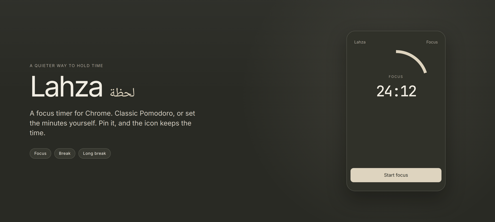
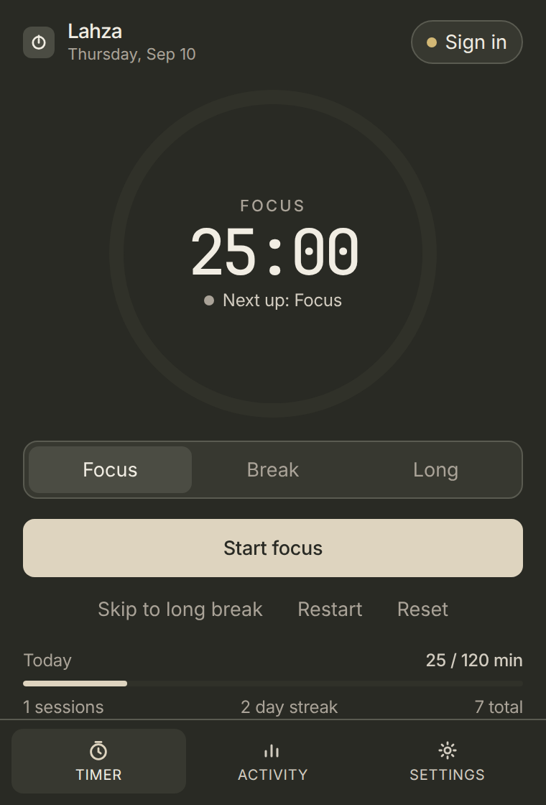
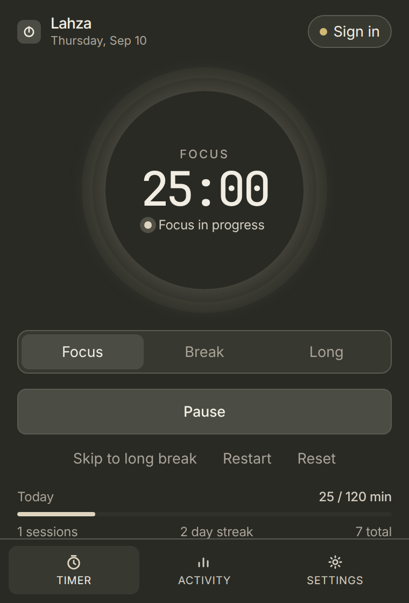
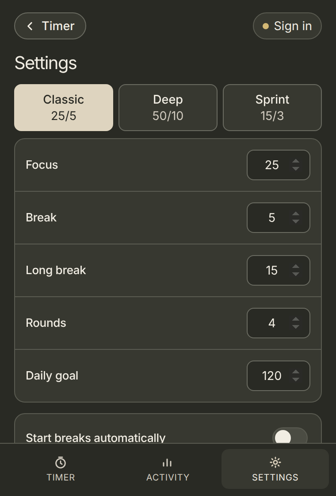
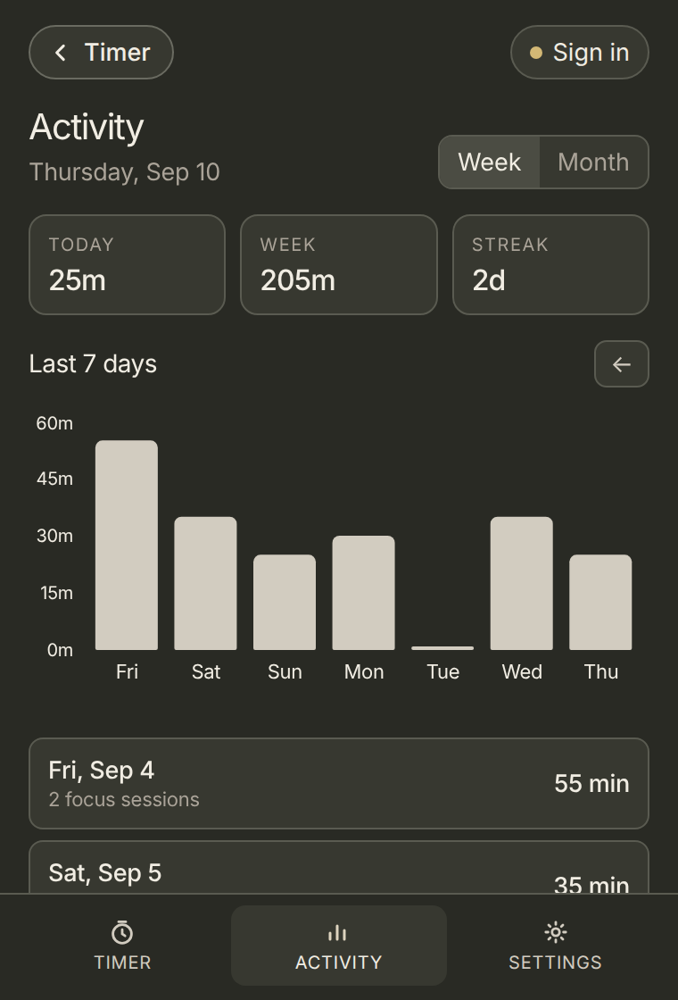
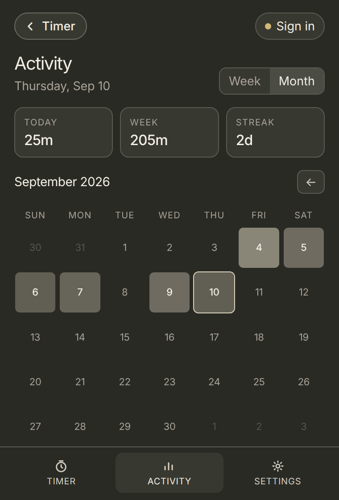
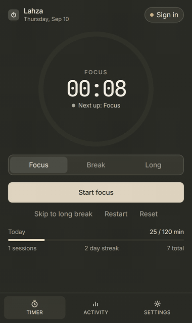

  

# Lahza

Now officially live on the [Chrome Web Store](https://chromewebstore.google.com/detail/lahza/okgndimocefoedonmgcgpnknhphaehkc).

Lahza is a focus timer for Chrome. You can run a classic Pomodoro — 25 minutes of work, 5 of rest — or set the lengths yourself. After four focus sessions it offers a longer break.

Pin it on the toolbar. While a session is running, the icon shows the time you have left. When it ends, Chrome sends a notification. There’s a chime too, if you leave sound on.

Activity has today, your week, and your streak. Week is a bar chart. Month is a heat map of the days you focused.

`Alt+Shift+P` starts or pauses from any tab. Sign in if you want the same timer on every Chrome profile.

*Lahza* (لحظة) is said **LAH-zah**.

  
  
  

  
  
  

## Install

[Add Lahza from the Chrome Web Store](https://chromewebstore.google.com/detail/lahza/okgndimocefoedonmgcgpnknhphaehkc).
